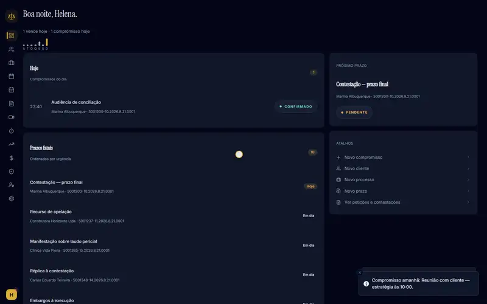

# Agenda-Juri

> Case, deadline and client management for a law firm, with Google Calendar/Drive sync and AI-generated meeting transcripts and summaries.

**Production runbook:** [deploy/gcp-free/README.md](deploy/gcp-free/README.md) · **Docs in Portuguese (OAuth and Drive setup):** [docs/README.pt-BR.md](docs/README.pt-BR.md)

[](https://github.com/LorenzoMarty/RS-Advocacia-CRM/actions/workflows/quality.yml)




<sub>Walkthrough of the app running locally with fictional demo data (sped up 2x). [Full-quality video](docs/demo.mp4).</sub>

## What it does

- **Clients, cases and deadlines** in one place, with a calendar view and a customizable dashboard.
- **Google Calendar sync:** appointments are pushed to the enabled calendars; changes come back through incremental sync (`syncToken`) and push notifications (webhooks).
- **Google Drive documents per client:** resumable uploads straight from the browser to Drive, bulk import of existing client folders, and continuous sync of folder changes.
- **Meetings with AI:** recording, transcription and summary, processed off the request cycle by Celery workers.
- **Google login** through a single backend OAuth flow. Tokens are stored encrypted (Fernet) on the server and never reach the React app.

## How it works

```text
React 19 (Vite)  ──►  Django 6  ──►  PostgreSQL
                         │
                         ├──►  Celery workers  ◄──►  Redis   (meeting transcription and summaries)
                         ├──►  Google Calendar / Drive APIs  (sync, webhooks, resumable uploads)
                         └──►  OpenAI                        (transcription and summaries)
```

Backend apps: `clientes`, `processos`, `prazos`, `agenda`, `peticoes`, `documentos`, `financeiro`, `meetings`, `notificacoes`, `integrations`, `usuarios`, `ai`.

## Tech stack

| Layer | Technology |
|---|---|
| Backend | Django 6, Gunicorn, Celery + Redis, PostgreSQL (psycopg) |
| Frontend | React 19, Vite, React Router 7, Tailwind CSS, Zod |
| Integrations | Google Calendar and Drive APIs, OpenAI (transcription and summaries) |
| Deploy | Docker Compose with Caddy (TLS), see [`deploy/gcp-free`](deploy/gcp-free) |
| Tests | Django `TestCase` suites (backend), Vitest (frontend) |

## Getting started

```bash
# backend
cd backend
python -m venv .venv && source .venv/bin/activate   # Windows: .venv\Scripts\activate
pip install -r requirements.txt
cp .env.example .env        # fill in DATABASE_URL, SECRET_KEY and the GOOGLE_* / OPENAI_* values you need
python manage.py migrate
python manage.py runserver

# meeting processing (separate terminal; on Windows add --pool=solo)
celery -A jurisagenda worker -l INFO

# frontend
cd frontend
npm install
npm run dev
```

Without Redis, set `MEETINGS_PROCESSING_MODE=inline` to process short recordings inside the upload request.

## Quality checks

```bash
cd backend && python manage.py test
cd frontend && npm test
```

The [quality gate](.github/workflows/quality.yml) can be run from the Actions tab (`workflow_dispatch`) and runs on pull requests to `main`: backend lint (ruff) and Django tests against real Postgres and Redis service containers, plus frontend lint (ESLint) and Vitest.

## Deployment

The production layout (web, worker, beat, Redis and Caddy on one VM) is described in [`deploy/gcp-free/README.md`](deploy/gcp-free/README.md). The original Portuguese runbook, including OAuth and Drive setup, is kept in [`docs/README.pt-BR.md`](docs/README.pt-BR.md).

## Status

Completed (March to September 2026). Portfolio reference: client data and production configuration are not part of this repository.

## License

[MIT](LICENSE)

## Author

**Lorenzo Marty** — [GitHub](https://github.com/LorenzoMarty)
